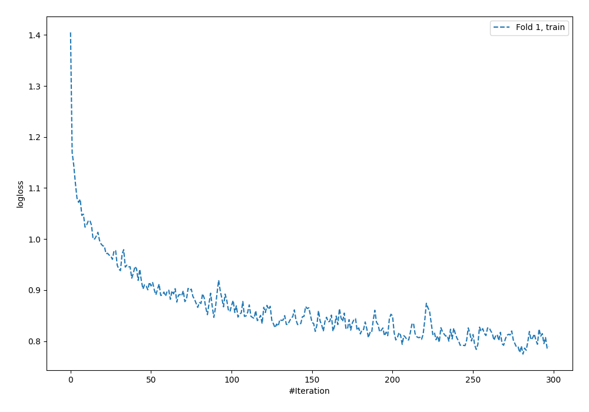
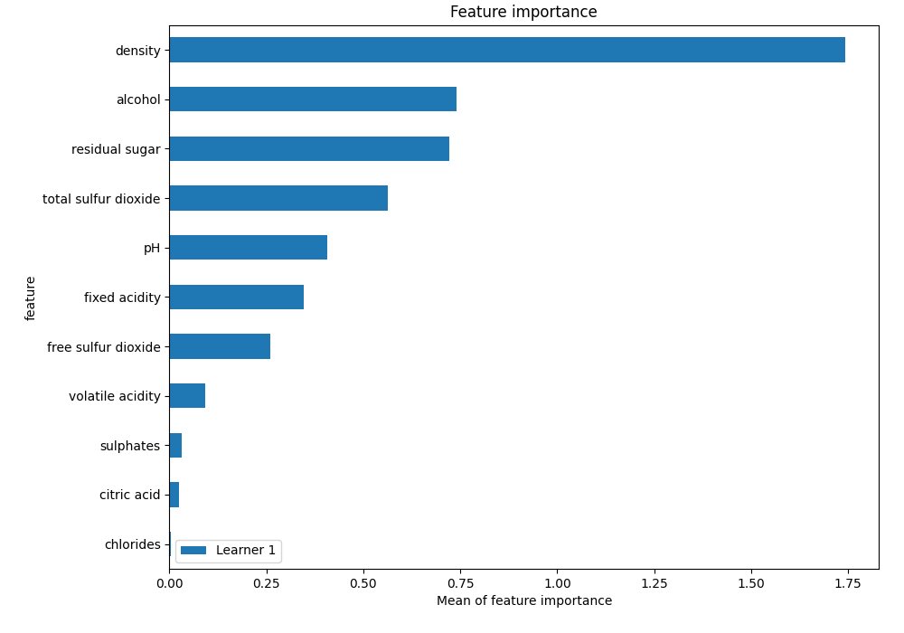
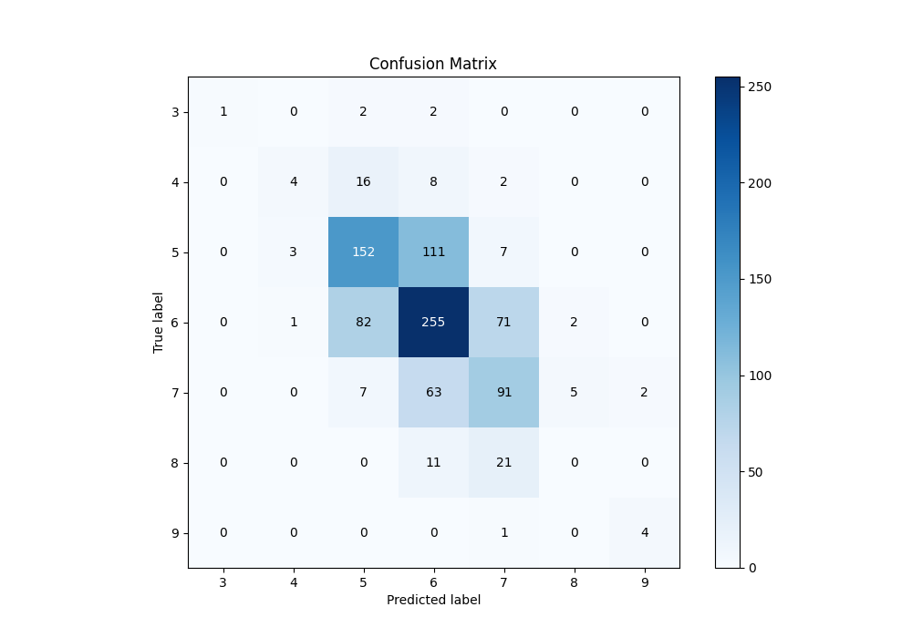
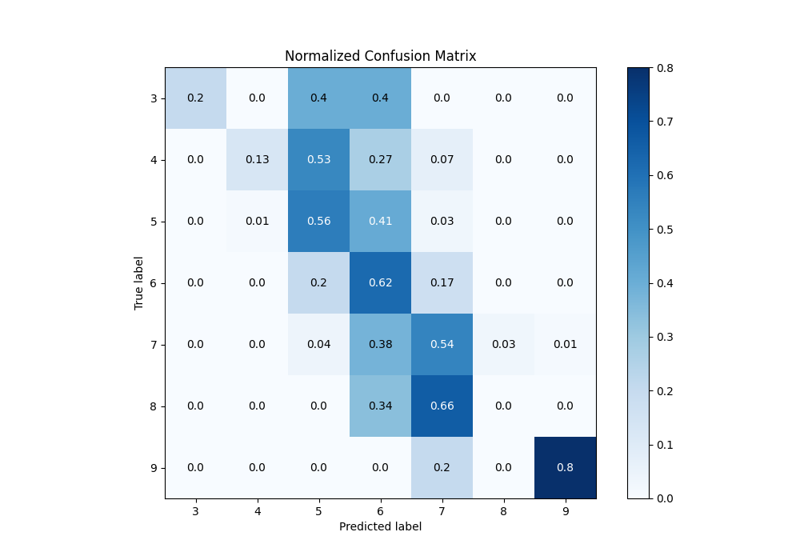
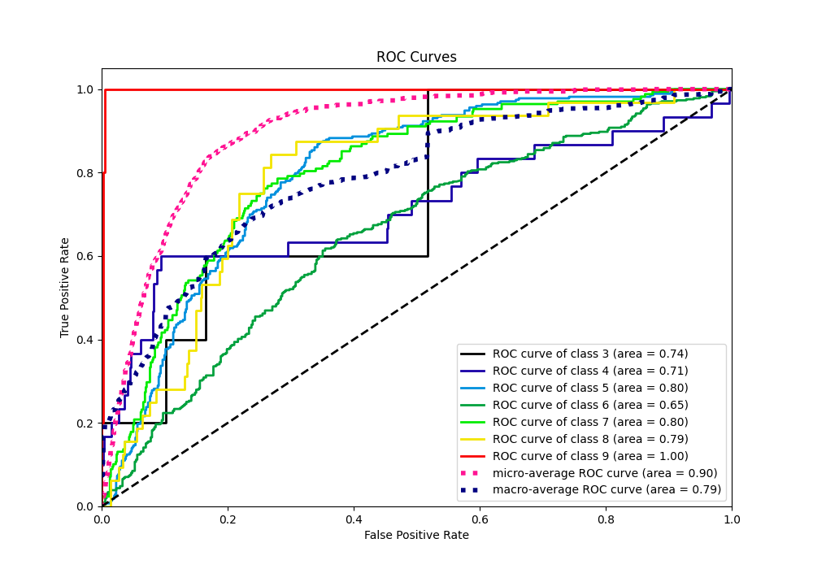
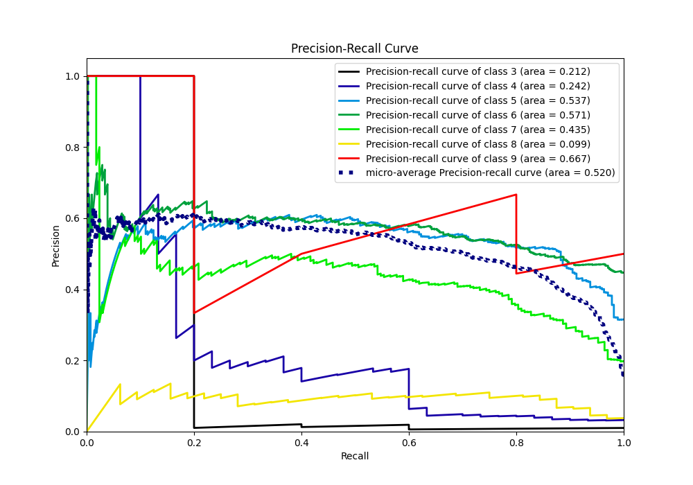

# Summary of 3_Default_NeuralNetwork

[<< Go back](../README.md)

## Neural Network
- **n_jobs**: -1
- **dense_1_size**: 32
- **dense_2_size**: 16
- **learning_rate**: 0.05
- **num_class**: 7
- **explain_level**: 1

## Validation
 - **validation_type**: split
 - **train_ratio**: 0.75
 - **shuffle**: True
 - **stratify**: True

## Optimized metric
f1

## Training time

4.6 seconds

### Metric details
|           |        3 |         4 |          5 |          6 |          7 |   8 |        9 |   accuracy |   macro avg |   weighted avg |   logloss |
|:----------|---------:|----------:|-----------:|-----------:|-----------:|----:|---------:|-----------:|------------:|---------------:|----------:|
| precision | 1        |  0.5      |   0.586873 |   0.566667 |   0.471503 |   0 | 0.666667 |   0.548701 |    0.541673 |       0.536431 |   1.26483 |
| recall    | 0.2      |  0.133333 |   0.556777 |   0.620438 |   0.541667 |   0 | 0.8      |   0.548701 |    0.407459 |       0.548701 |   1.26483 |
| f1-score  | 0.333333 |  0.210526 |   0.571429 |   0.592334 |   0.504155 |   0 | 0.727273 |   0.548701 |    0.419864 |       0.536544 |   1.26483 |
| support   | 5        | 30        | 273        | 411        | 168        |  32 | 5        |   0.548701 |  924        |     924        |   1.26483 |

## Confusion matrix
|              |   Predicted as 3 |   Predicted as 4 |   Predicted as 5 |   Predicted as 6 |   Predicted as 7 |   Predicted as 8 |   Predicted as 9 |
|:-------------|-----------------:|-----------------:|-----------------:|-----------------:|-----------------:|-----------------:|-----------------:|
| Labeled as 3 |                1 |                0 |                2 |                2 |                0 |                0 |                0 |
| Labeled as 4 |                0 |                4 |               16 |                8 |                2 |                0 |                0 |
| Labeled as 5 |                0 |                3 |              152 |              111 |                7 |                0 |                0 |
| Labeled as 6 |                0 |                1 |               82 |              255 |               71 |                2 |                0 |
| Labeled as 7 |                0 |                0 |                7 |               63 |               91 |                5 |                2 |
| Labeled as 8 |                0 |                0 |                0 |               11 |               21 |                0 |                0 |
| Labeled as 9 |                0 |                0 |                0 |                0 |                1 |                0 |                4 |

## Learning curves

## Permutation-based Importance

## Confusion Matrix

## Normalized Confusion Matrix

## ROC Curve

## Precision Recall Curve

[<< Go back](../README.md)
