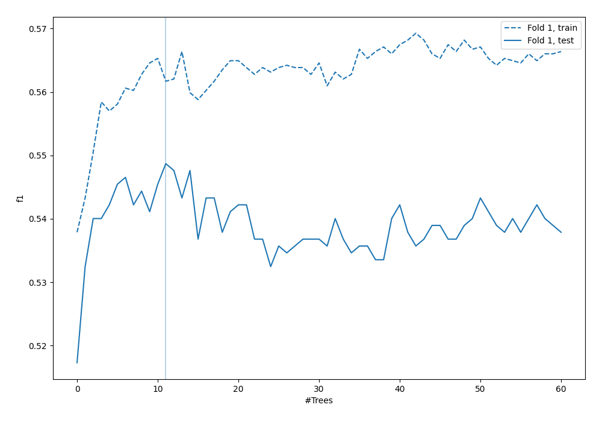
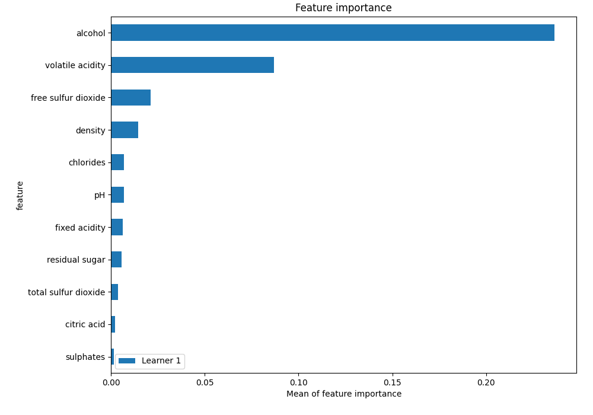
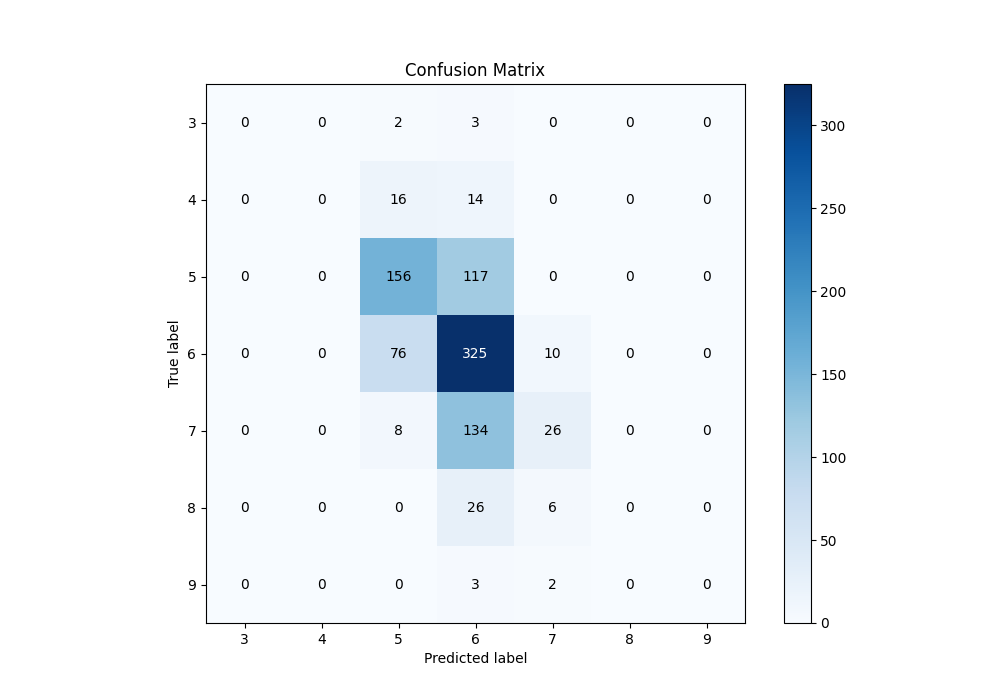
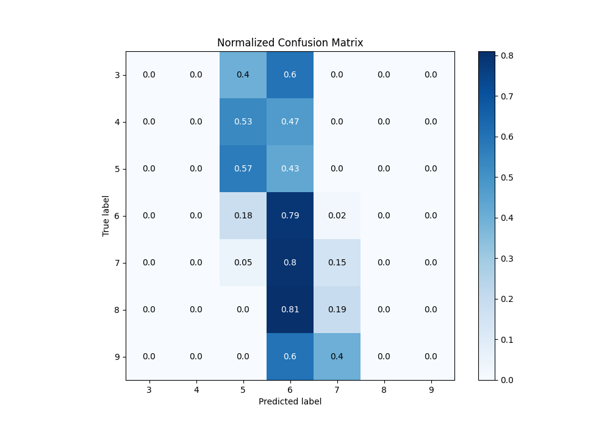
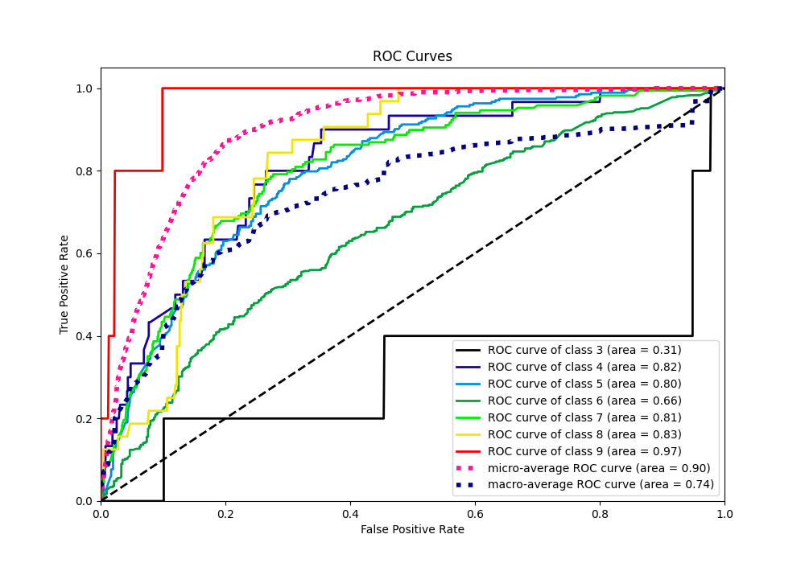
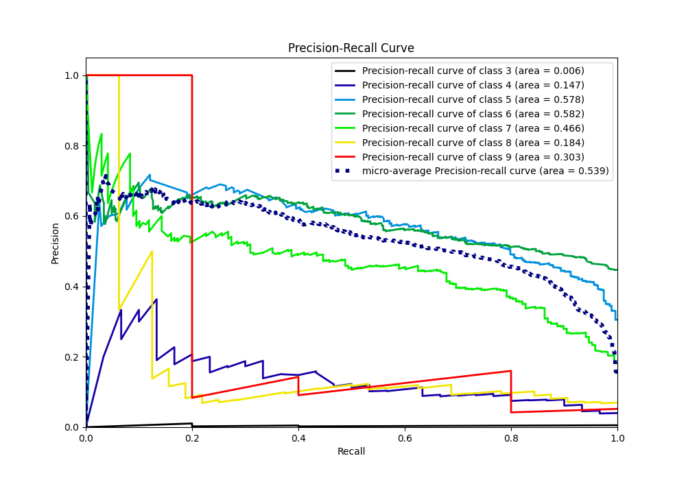

# Summary of 4_Default_RandomForest

[<< Go back](../README.md)

## Random Forest
- **n_jobs**: -1
- **criterion**: gini
- **max_features**: 0.9
- **min_samples_split**: 30
- **max_depth**: 4
- **eval_metric_name**: f1
- **num_class**: 7
- **explain_level**: 1

## Validation
 - **validation_type**: split
 - **train_ratio**: 0.75
 - **shuffle**: True
 - **stratify**: True

## Optimized metric
f1

## Training time

1.6 seconds

### Metric details
|           |   3 |   4 |          5 |          6 |          7 |   8 |   9 |   accuracy |   macro avg |   weighted avg |   logloss |
|:----------|----:|----:|-----------:|-----------:|-----------:|----:|----:|-----------:|------------:|---------------:|----------:|
| precision |   0 |   0 |   0.604651 |   0.522508 |   0.590909 |   0 |   0 |   0.548701 |    0.245438 |       0.518499 |   1.09886 |
| recall    |   0 |   0 |   0.571429 |   0.790754 |   0.154762 |   0 |   0 |   0.548701 |    0.216706 |       0.548701 |   1.09886 |
| f1-score  |   0 |   0 |   0.587571 |   0.629235 |   0.245283 |   0 |   0 |   0.548701 |    0.20887  |       0.498084 |   1.09886 |
| support   |   5 |  30 | 273        | 411        | 168        |  32 |   5 |   0.548701 |  924        |     924        |   1.09886 |

## Confusion matrix
|              |   Predicted as 3 |   Predicted as 4 |   Predicted as 5 |   Predicted as 6 |   Predicted as 7 |   Predicted as 8 |   Predicted as 9 |
|:-------------|-----------------:|-----------------:|-----------------:|-----------------:|-----------------:|-----------------:|-----------------:|
| Labeled as 3 |                0 |                0 |                2 |                3 |                0 |                0 |                0 |
| Labeled as 4 |                0 |                0 |               16 |               14 |                0 |                0 |                0 |
| Labeled as 5 |                0 |                0 |              156 |              117 |                0 |                0 |                0 |
| Labeled as 6 |                0 |                0 |               76 |              325 |               10 |                0 |                0 |
| Labeled as 7 |                0 |                0 |                8 |              134 |               26 |                0 |                0 |
| Labeled as 8 |                0 |                0 |                0 |               26 |                6 |                0 |                0 |
| Labeled as 9 |                0 |                0 |                0 |                3 |                2 |                0 |                0 |

## Learning curves

## Permutation-based Importance

## Confusion Matrix

## Normalized Confusion Matrix

## ROC Curve

## Precision Recall Curve

[<< Go back](../README.md)
